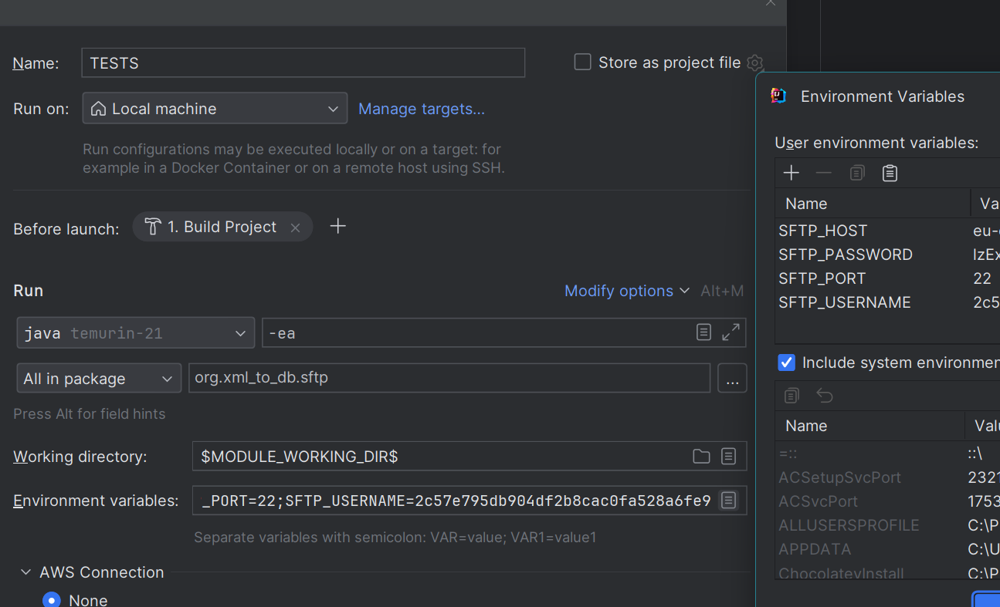

# 🚀 XMLMorphosis: The Ultimate XML to DB Transformer 🚀

[](LICENSE.md)
[](https://azure.microsoft.com/services/functions/)
[](https://aws.amazon.com/lambda/)

## 🌟 Transform Your XML Data into Database Magic! 🌟

Welcome to XMLMorphosis, the Swiss Army knife of XML processing! Are you tired of wrestling with clunky XML files and
wishing they would magically transform into sleek database entries? Look no further! XMLMorphosis is here to save the
day! 🦸‍♂️

### 🎭 What's This Sorcery?

XMLMorphosis is a powerful, flexible, and extensible system designed to process XML files, validate them against XSD
schemas, and store the processed data in various database systems. Built as an Azure Function (with a secret love for
AWS Lambda), it's ready to tackle your XML challenges in the cloud! ☁️

### 🌈 Features That'll Make You Go "Wow!"

- 🔄 **Multi-Cloud Mastery**: Works with Azure Blob Storage AND AWS S3. We don't play favorites!
- 🧙‍♂️ **XML Whisperer**: Dynamically processes XML based on XML/XSD pairs. It's like it can read XML minds!
- 🎨 **Database Chameleon**: Flexibly connects to different databases for different XML types. It's a master of disguise!
- 🧩 **Extensibility Extraordinaire**: Easily add new processors and database connections. It's like LEGO for data
  processing!
- 🛡️ **Validation Vanguard**: Ensures your XML is ship-shape before processing. No sneaky invalid XML on our watch!

### 🚀 Quick Start

1. Clone this repository (you know you want to!)
2. Configure your `application.properties` (it's like choosing your adventure!)
3. Build the project: `mvn clean package` (watch the magic happen!)
4. Deploy to Azure or AWS (let it fly free in the cloud!)
5. Send an HTTP POST request and watch your XML transform into database gold! 🏆

### 🛠️ Extensibility: Make It Your Own!

Want to add a new storage service? Go for it!
Need a custom XML processor? The sky's the limit!
Dreaming of a new database connection? Dream big and implement away!

Check out our [documentation](docs/DOCUMENTATION.md) for all the juicy details on extending XMLMorphosis.

### 🆘 Need Help?

Stuck? Confused? Just want to chat about the mysteries of XML? We've got your back! Check out
our [troubleshooting guide](docs/TROUBLESHOOTING.md) or reach out to our team of XML whisperers.

### 📜 License

XMLMorphosis is released under a custom license. It's free for personal and open-source use, but if you want to use it
for commercial activities, you'll need to contact us. We don't bite, and we love to hear about cool projects!

### 🌟 Contribute and Shine!

Found a bug? Have an idea for an amazing feature? We're all ears! Open an issue, submit a pull request, or send us a
carrier pigeon. Let's make XMLMorphosis even more magical together!

Remember, with great XML comes great responsibility. Use XMLMorphosis wisely, and may your data always flow smoothly! 🌊

### 🚀 Create a random Sftp Test Server:
    
    ```bash
    https://sftpcloud.io/tools/free-sftp-server
    
    Use the above link to generate the sftp server credentials and add those in your test run configuration as Environment variables.
    
    A screenshot is given below for reference.
    ```



